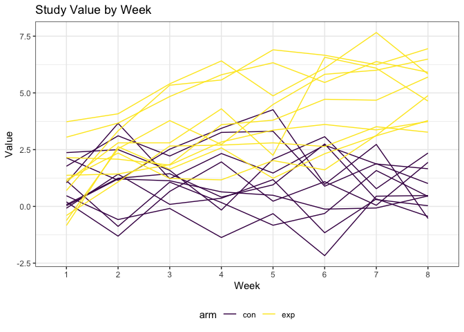
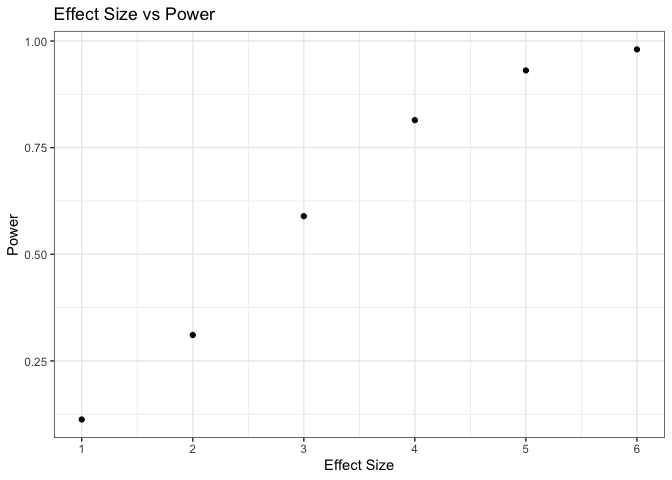
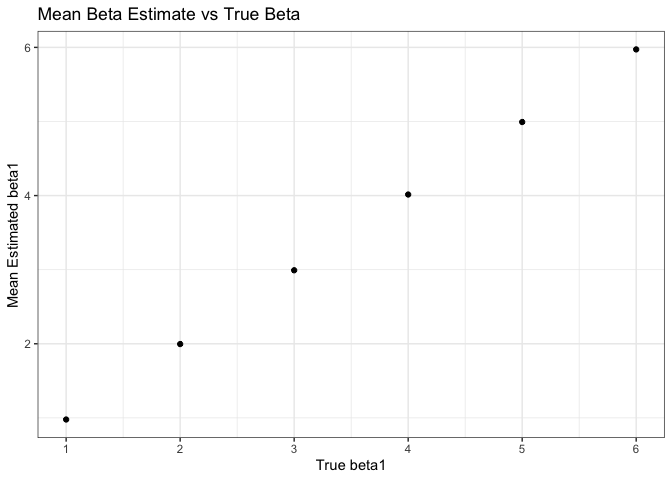
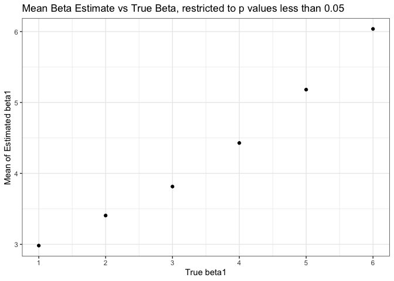

Homework 5
================
Alice Tivarovsky
11/3/2019

## Setup Code

``` r
library(tidyverse)
```

    ## ── Attaching packages ─────────────────────────────────────────── tidyverse 1.2.1 ──

    ## ✔ ggplot2 3.2.1     ✔ purrr   0.3.2
    ## ✔ tibble  2.1.3     ✔ dplyr   0.8.3
    ## ✔ tidyr   1.0.0     ✔ stringr 1.4.0
    ## ✔ readr   1.3.1     ✔ forcats 0.4.0

    ## ── Conflicts ────────────────────────────────────────────── tidyverse_conflicts() ──
    ## ✖ dplyr::filter() masks stats::filter()
    ## ✖ dplyr::lag()    masks stats::lag()

``` r
library(viridis)
```

    ## Loading required package: viridisLite

``` r
knitr::opts_chunk$set(
    echo = TRUE,
    warning = FALSE,
  out.width = "90%"
)
options(
  ggplot2.continuous.colour = "viridis",
  ggplot2.continuous.fill = "viridis"
)
scale_colour_discrete = scale_colour_viridis_d
scale_fill_discrete = scale_fill_viridis_d
theme_set(theme_bw() + theme(legend.position = "bottom"))

set.seed(10)
```

## Problem 1

The code chunk below pulls in the iris dataset.

``` r
iris_with_missing = iris %>% 
  map_df(~replace(.x, sample(1:150, 20), NA)) %>%
  mutate(Species = as.character(Species))

iris_with_missing
```

    ## # A tibble: 150 x 5
    ##    Sepal.Length Sepal.Width Petal.Length Petal.Width Species
    ##           <dbl>       <dbl>        <dbl>       <dbl> <chr>  
    ##  1          5.1         3.5          1.4         0.2 setosa 
    ##  2          4.9         3            1.4         0.2 setosa 
    ##  3          4.7         3.2          1.3         0.2 setosa 
    ##  4          4.6         3.1          1.5        NA   setosa 
    ##  5          5           3.6          1.4         0.2 setosa 
    ##  6          5.4         3.9          1.7         0.4 setosa 
    ##  7         NA           3.4          1.4         0.3 setosa 
    ##  8          5           3.4          1.5         0.2 setosa 
    ##  9          4.4         2.9          1.4         0.2 setosa 
    ## 10          4.9         3.1         NA           0.1 setosa 
    ## # … with 140 more rows

Next, we define a funtion that replaces missing values for numeric and
character variables.

``` r
iris_replace = function(x){
  
  if (is.numeric(x)) {
    y = mean(x, na.rm = TRUE)
    x = replace(x, is.na(x), y)
  } else if (is.character(x)) {
    x = replace(x, is.na(x), "virginica")
  }
}
```

Finally, we map the function to the dataset.

``` r
output = map_df(iris_with_missing, iris_replace)

output
```

    ## # A tibble: 150 x 5
    ##    Sepal.Length Sepal.Width Petal.Length Petal.Width Species
    ##           <dbl>       <dbl>        <dbl>       <dbl> <chr>  
    ##  1         5.1          3.5         1.4         0.2  setosa 
    ##  2         4.9          3           1.4         0.2  setosa 
    ##  3         4.7          3.2         1.3         0.2  setosa 
    ##  4         4.6          3.1         1.5         1.19 setosa 
    ##  5         5            3.6         1.4         0.2  setosa 
    ##  6         5.4          3.9         1.7         0.4  setosa 
    ##  7         5.82         3.4         1.4         0.3  setosa 
    ##  8         5            3.4         1.5         0.2  setosa 
    ##  9         4.4          2.9         1.4         0.2  setosa 
    ## 10         4.9          3.1         3.77        0.1  setosa 
    ## # … with 140 more rows

## Problem 2

First, we make a dataframe comprised of the file names.

``` r
files = list.files(path = "./data")
files
```

    ##  [1] "con_01.csv" "con_02.csv" "con_03.csv" "con_04.csv" "con_05.csv"
    ##  [6] "con_06.csv" "con_07.csv" "con_08.csv" "con_09.csv" "con_10.csv"
    ## [11] "exp_01.csv" "exp_02.csv" "exp_03.csv" "exp_04.csv" "exp_05.csv"
    ## [16] "exp_06.csv" "exp_07.csv" "exp_08.csv" "exp_09.csv" "exp_10.csv"

Next, we write a function that reads in data from vector “files” and
saves the result as a new variable in the dataframe.

``` r
read_num2 = function(x){
  
  str_c("./data/", x) %>% 
    read_csv() %>% 
    pivot_longer(
      week_1:week_8,
      names_to = "week",
      names_prefix = "week_",
      values_to = "value"
      ) %>% 
    mutate("patient_id" = str_remove(x, ".csv"))
}
```

Then we map the function to the files vector.

``` r
output = map_df(files, read_num2)
```

    ## Parsed with column specification:
    ## cols(
    ##   week_1 = col_double(),
    ##   week_2 = col_double(),
    ##   week_3 = col_double(),
    ##   week_4 = col_double(),
    ##   week_5 = col_double(),
    ##   week_6 = col_double(),
    ##   week_7 = col_double(),
    ##   week_8 = col_double()
    ## )
    ## Parsed with column specification:
    ## cols(
    ##   week_1 = col_double(),
    ##   week_2 = col_double(),
    ##   week_3 = col_double(),
    ##   week_4 = col_double(),
    ##   week_5 = col_double(),
    ##   week_6 = col_double(),
    ##   week_7 = col_double(),
    ##   week_8 = col_double()
    ## )
    ## Parsed with column specification:
    ## cols(
    ##   week_1 = col_double(),
    ##   week_2 = col_double(),
    ##   week_3 = col_double(),
    ##   week_4 = col_double(),
    ##   week_5 = col_double(),
    ##   week_6 = col_double(),
    ##   week_7 = col_double(),
    ##   week_8 = col_double()
    ## )
    ## Parsed with column specification:
    ## cols(
    ##   week_1 = col_double(),
    ##   week_2 = col_double(),
    ##   week_3 = col_double(),
    ##   week_4 = col_double(),
    ##   week_5 = col_double(),
    ##   week_6 = col_double(),
    ##   week_7 = col_double(),
    ##   week_8 = col_double()
    ## )
    ## Parsed with column specification:
    ## cols(
    ##   week_1 = col_double(),
    ##   week_2 = col_double(),
    ##   week_3 = col_double(),
    ##   week_4 = col_double(),
    ##   week_5 = col_double(),
    ##   week_6 = col_double(),
    ##   week_7 = col_double(),
    ##   week_8 = col_double()
    ## )
    ## Parsed with column specification:
    ## cols(
    ##   week_1 = col_double(),
    ##   week_2 = col_double(),
    ##   week_3 = col_double(),
    ##   week_4 = col_double(),
    ##   week_5 = col_double(),
    ##   week_6 = col_double(),
    ##   week_7 = col_double(),
    ##   week_8 = col_double()
    ## )
    ## Parsed with column specification:
    ## cols(
    ##   week_1 = col_double(),
    ##   week_2 = col_double(),
    ##   week_3 = col_double(),
    ##   week_4 = col_double(),
    ##   week_5 = col_double(),
    ##   week_6 = col_double(),
    ##   week_7 = col_double(),
    ##   week_8 = col_double()
    ## )
    ## Parsed with column specification:
    ## cols(
    ##   week_1 = col_double(),
    ##   week_2 = col_double(),
    ##   week_3 = col_double(),
    ##   week_4 = col_double(),
    ##   week_5 = col_double(),
    ##   week_6 = col_double(),
    ##   week_7 = col_double(),
    ##   week_8 = col_double()
    ## )
    ## Parsed with column specification:
    ## cols(
    ##   week_1 = col_double(),
    ##   week_2 = col_double(),
    ##   week_3 = col_double(),
    ##   week_4 = col_double(),
    ##   week_5 = col_double(),
    ##   week_6 = col_double(),
    ##   week_7 = col_double(),
    ##   week_8 = col_double()
    ## )
    ## Parsed with column specification:
    ## cols(
    ##   week_1 = col_double(),
    ##   week_2 = col_double(),
    ##   week_3 = col_double(),
    ##   week_4 = col_double(),
    ##   week_5 = col_double(),
    ##   week_6 = col_double(),
    ##   week_7 = col_double(),
    ##   week_8 = col_double()
    ## )
    ## Parsed with column specification:
    ## cols(
    ##   week_1 = col_double(),
    ##   week_2 = col_double(),
    ##   week_3 = col_double(),
    ##   week_4 = col_double(),
    ##   week_5 = col_double(),
    ##   week_6 = col_double(),
    ##   week_7 = col_double(),
    ##   week_8 = col_double()
    ## )
    ## Parsed with column specification:
    ## cols(
    ##   week_1 = col_double(),
    ##   week_2 = col_double(),
    ##   week_3 = col_double(),
    ##   week_4 = col_double(),
    ##   week_5 = col_double(),
    ##   week_6 = col_double(),
    ##   week_7 = col_double(),
    ##   week_8 = col_double()
    ## )
    ## Parsed with column specification:
    ## cols(
    ##   week_1 = col_double(),
    ##   week_2 = col_double(),
    ##   week_3 = col_double(),
    ##   week_4 = col_double(),
    ##   week_5 = col_double(),
    ##   week_6 = col_double(),
    ##   week_7 = col_double(),
    ##   week_8 = col_double()
    ## )
    ## Parsed with column specification:
    ## cols(
    ##   week_1 = col_double(),
    ##   week_2 = col_double(),
    ##   week_3 = col_double(),
    ##   week_4 = col_double(),
    ##   week_5 = col_double(),
    ##   week_6 = col_double(),
    ##   week_7 = col_double(),
    ##   week_8 = col_double()
    ## )
    ## Parsed with column specification:
    ## cols(
    ##   week_1 = col_double(),
    ##   week_2 = col_double(),
    ##   week_3 = col_double(),
    ##   week_4 = col_double(),
    ##   week_5 = col_double(),
    ##   week_6 = col_double(),
    ##   week_7 = col_double(),
    ##   week_8 = col_double()
    ## )
    ## Parsed with column specification:
    ## cols(
    ##   week_1 = col_double(),
    ##   week_2 = col_double(),
    ##   week_3 = col_double(),
    ##   week_4 = col_double(),
    ##   week_5 = col_double(),
    ##   week_6 = col_double(),
    ##   week_7 = col_double(),
    ##   week_8 = col_double()
    ## )
    ## Parsed with column specification:
    ## cols(
    ##   week_1 = col_double(),
    ##   week_2 = col_double(),
    ##   week_3 = col_double(),
    ##   week_4 = col_double(),
    ##   week_5 = col_double(),
    ##   week_6 = col_double(),
    ##   week_7 = col_double(),
    ##   week_8 = col_double()
    ## )
    ## Parsed with column specification:
    ## cols(
    ##   week_1 = col_double(),
    ##   week_2 = col_double(),
    ##   week_3 = col_double(),
    ##   week_4 = col_double(),
    ##   week_5 = col_double(),
    ##   week_6 = col_double(),
    ##   week_7 = col_double(),
    ##   week_8 = col_double()
    ## )
    ## Parsed with column specification:
    ## cols(
    ##   week_1 = col_double(),
    ##   week_2 = col_double(),
    ##   week_3 = col_double(),
    ##   week_4 = col_double(),
    ##   week_5 = col_double(),
    ##   week_6 = col_double(),
    ##   week_7 = col_double(),
    ##   week_8 = col_double()
    ## )
    ## Parsed with column specification:
    ## cols(
    ##   week_1 = col_double(),
    ##   week_2 = col_double(),
    ##   week_3 = col_double(),
    ##   week_4 = col_double(),
    ##   week_5 = col_double(),
    ##   week_6 = col_double(),
    ##   week_7 = col_double(),
    ##   week_8 = col_double()
    ## )

``` r
output
```

    ## # A tibble: 160 x 3
    ##    week  value patient_id
    ##    <chr> <dbl> <chr>     
    ##  1 1      0.2  con_01    
    ##  2 2     -1.31 con_01    
    ##  3 3      0.66 con_01    
    ##  4 4      1.96 con_01    
    ##  5 5      0.23 con_01    
    ##  6 6      1.09 con_01    
    ##  7 7      0.05 con_01    
    ##  8 8      1.94 con_01    
    ##  9 1      1.13 con_02    
    ## 10 2     -0.88 con_02    
    ## # … with 150 more rows

Next, we tidy the output data frame.

``` r
df_num2 = 
  output %>% 
  mutate(
    arm = str_replace(patient_id, "_..", ""), 
    arm = as_factor(arm)
  ) %>% 
  select(
    patient_id, arm, week, value
  )

df_num2
```

    ## # A tibble: 160 x 4
    ##    patient_id arm   week  value
    ##    <chr>      <fct> <chr> <dbl>
    ##  1 con_01     con   1      0.2 
    ##  2 con_01     con   2     -1.31
    ##  3 con_01     con   3      0.66
    ##  4 con_01     con   4      1.96
    ##  5 con_01     con   5      0.23
    ##  6 con_01     con   6      1.09
    ##  7 con_01     con   7      0.05
    ##  8 con_01     con   8      1.94
    ##  9 con_02     con   1      1.13
    ## 10 con_02     con   2     -0.88
    ## # … with 150 more rows

Finally, we construct a spaghetti plot of df\_num2.

``` r
df_num2 %>% 
  ggplot(aes(x = week, y = value)) + 
  geom_line(aes(group = patient_id, color = arm)) + 
   labs(
    title = "Study Value by Week",
    x = "Week",
    y = "Value"
   )
```



In the experiemntal arm, the values generally increase week over week.
In the control arm, the values generally fluctuate around the same point
without any observable upwards or downwards trend.

## Problem 3

First, we write a function that generates simulation data and fits a
linear model.

``` r
n = 30
sdev = sqrt(50) 
beta_0 = 2


sim_slr = function(n, beta_0 = 2, beta_1 = 0) {
  
  sim_data = tibble(
    x_i1 = rnorm(n, 0, 1),
    y = beta_0 + beta_1*x_i1 + rnorm(n, 0, sdev)
  )
  
ls_fit = lm(y ~ x_i1, data = sim_data) %>% 
  broom::tidy() %>% 
  filter(term == "x_i1") %>% 
  select("estimate", "p.value") %>% 
  rename(beta_1_hat = estimate)

}
```

Next we run the simulation for beta\_1 = 0:

``` r
sim_results = 
  rerun(10000, sim_slr(n, beta_0 = 2, beta_1 = 0)) %>% 
  bind_rows() 

sim_results
```

    ## # A tibble: 10,000 x 2
    ##    beta_1_hat  p.value
    ##         <dbl>    <dbl>
    ##  1      2.02  0.207   
    ##  2      1.23  0.182   
    ##  3      0.603 0.606   
    ##  4      3.03  0.000149
    ##  5     -1.19  0.471   
    ##  6     -1.49  0.219   
    ##  7     -1.97  0.192   
    ##  8      0.331 0.769   
    ##  9      0.576 0.670   
    ## 10      2.40  0.134   
    ## # … with 9,990 more rows

Now re-running the simulation for beta\_1 values (1, 2, 3, 4, 5).

``` r
sim_results_2 = 
  tibble(beta_1 = c(1:6)) %>% 
  mutate(
    output_list = map(.x = beta_1, ~rerun(10000, sim_slr(n, beta_0 = 2, beta_1 = .x))),
    estimate_list = map(output_list, bind_rows)) %>% 
  select(-output_list) %>% 
  unnest(estimate_list) 

sim_results_2
```

    ## # A tibble: 60,000 x 3
    ##    beta_1 beta_1_hat p.value
    ##     <int>      <dbl>   <dbl>
    ##  1      1     0.0877 0.947  
    ##  2      1     3.11   0.00881
    ##  3      1     1.81   0.116  
    ##  4      1     3.03   0.0211 
    ##  5      1     2.06   0.0530 
    ##  6      1    -0.478  0.672  
    ##  7      1     1.67   0.166  
    ##  8      1    -0.244  0.882  
    ##  9      1     1.22   0.397  
    ## 10      1     1.22   0.321  
    ## # … with 59,990 more rows

Plot of true beta\_1 vs proportion of times that the null was rejected.

``` r
sim_results_plot = 
  sim_results_2 %>% 
  group_by(beta_1) %>% 
  summarise(n = n(), sig = sum(p.value < 0.05), prop = sig/n) %>% 
  ggplot(aes(x = beta_1, y = prop)) +
  geom_point() +
  labs(
    title = "Effect Size vs Power", 
    x = "Effect Size", 
    y = "Power"
  ) +
  scale_x_continuous(
    breaks = c(1:6),
    labels = c("1", "2", "3", "4", "5", "6")
  )

sim_results_plot
```



Based on the plot, as the effect size increases (i.e. as beta
increases), the power also increases, appraoching but not reaching the
maximum value of 1.00 (100% power).

Now, plotting the results for true beta vs calculated beta, followed by
the same plot restricted to beta values that are statistically
significant at alpha = 0.05.

``` r
sim_results_2 %>% 
  group_by(beta_1) %>% 
  summarise(n = n(), beta_hat_mean = mean(beta_1_hat)) %>% 
  ggplot(aes(x = beta_1, y = beta_hat_mean)) +
  geom_point() +
  labs(
    title = "Mean Beta Estimate vs True Beta", 
    x = "True beta1", 
    y = "Mean Estimated beta1"
  ) +
  scale_x_continuous(
    breaks = c(1:6),
    labels = c("1", "2", "3", "4", "5", "6")
  )
```



``` r
sim_results_2 %>% 
  filter(p.value < 0.05) %>% 
  group_by(beta_1) %>% 
  summarise(n = n(), beta_hat_mean = mean(beta_1_hat)) %>% 
  ggplot(aes(x = beta_1, y = beta_hat_mean)) +
  geom_point() +
  labs(
    title = "Mean Beta Estimate vs True Beta, restricted to p values less than 0.05", 
    x = "True beta1", 
    y = "Mean of Estimated beta1"
  ) +
  scale_x_continuous(
    breaks = c(1:6),
    labels = c("1", "2", "3", "4", "5", "6")
  )
```



We observe that the first plot for unrestricted p-values is more precise
as far as the calculated beta vs the true beta, meaning that the average
of the estimated betas equals the true value at every point. When we
restrict the betas to only those significantly different from the true
beta, the results are less precise. This is because by filtering only
significant results, we are eliminating values close to the true beta
and keeping only values that diverge significantly from the true beta.
As such, the relationship between the mean estimated beta and the true
beta is not the precise one-to-one relationship seen in the unfiltered
plot.
